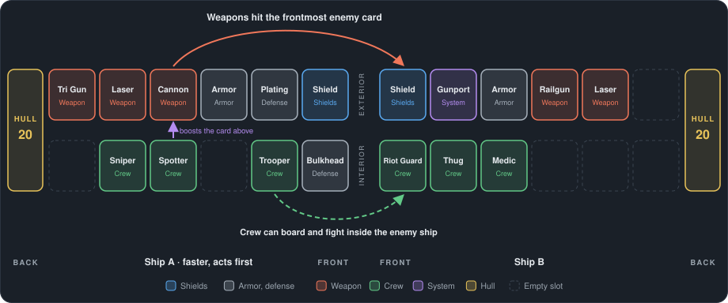

# Jango Cards

A card browser and fight simulator for **Jango**, a tableau-builder, sci-fi, auto-battler video game still under development.

**Use the tool here: https://rossers.github.io/JangoCards/**

Browse existing cards, read the design guide, and arrange boards of cards to fight in the simulator.

[How a fight works](#how-a-fight-works) · [Using the tool](#using-the-tool) · [Make your own sheet](#make-your-own-sheet-optional) · [Share your sheet](#share-your-sheet)

## How a fight works

- **Two ships, each with two rows and a hull.** The exterior row holds Shields, Armor and ship-to-ship weapons. The interior row houses crew members and subsystems. Each row has 4 to 8 card slots, with the hull behind them.
- **Fights are deterministic.** The larger a ship is (the more card slots), the slower it is, and the faster ship acts first. Each round, the two exterior rows take turns, card by card; then each ship's interior plays out, with its crew fighting any enemy boarders, defenders first.
- **Attacks hit the frontmost enemy card.** Once a row is empty, they hit the hull. Last ship with an intact hull wins!
- **Shields** never die: at 0 they go down, and recover after a round without damage. **Armor** is a sturdy wall. Shields are weak to Kinetic damage, Armor to Plasma.
- **The Maelstrom** starts at a set round (10 on the Example Sheet) and hits both ships every round, harder each time: the frontmost card first, what it can't take carrying on to the next, and the hull last. The interior takes half. Once it starts, Shields stop recovering, so no fight ends in a stalemate.

## Using the tool

### Balance sheets

A Balance Sheet is a complete set of cards with its own pricing rules and design notes. Each sheet tests a different balance idea, so the same card can have different numbers on different sheets. Switch sheets with the sheet name at the top left; the tool opens on the **Example Sheet**: one example card for each formula, and four example boards. They are there to learn the tool with, not a balanced or recommended deck. **Sheet** shows that sheet's formulas: what everything costs, with worked examples and a grid under each.

### Cards

The **Cards** view shows the sheet's cards. The tabs split them by group, the search box finds names, effects and tags, and the filters narrow them by role, damage type, lowest mark and more. **Details** on a card shows everything about it.

| On a card | Means |
|---|---|
| **Exterior / Interior** | The row it goes in, and for exterior cards, whether it sits in front of or behind the Armor. |
| **Role** | Its job: Filler, Support, Scaler, Centerpiece… |
| **Mk I+** | The lowest mark it comes in. Cards upgrade from Mk I to Mk V, and their numbers grow with the mark. |
| **3 kin** | Attack: damage per hit, colored by damage type (Kinetic, Thermal, Electric, Plasma, Radiation). **×2** means two hits each time it fires. |
| **♥ 12** | Health. |
| **Pips** | Ammo (one used each time it attacks) and charges (spent by effects). |
| **96/96 BP** | Budget points: what the card is worth against its budget. Green means on budget. |
| **2 cr** | Its price in credits. |
| **Effect** | What it does, and when: Fight Start, On Activate, After Attack, etc. |
| **Tags** | Words other cards refer to: Weapon, Crew, Shields, etc. |
| **Source Badge** | Where it came from: GDD, New, or the name of the friend who made it. |

### Guide

**Guide** opens the design guide for the current sheet: how card budgets work, what each stat and keyword costs, how card text is written, where cards belong on a ship, which sector a card fits, and what the simulations have found. It explains why a card has the numbers it has. Its tabs group it (Basics, Prices, Rules, Design), and **Search the guide** finds a word on every tab at once.

### Simulator

**Simulator** has three tabs:

- **Board Builder:** build a ship from the sheet's cards. Tap **+** to add a card; tap a card to move or remove it. **Fill with random** and **Arrange like a player** get you started. Save a board to fight with it.
- **Fight Sim:** pick two boards and watch them fight, step by step, with a log of every hit. The ships face each other as they will in the game: the exterior rows meet in the middle, and the top ship is drawn upside down (its rows keep their usual above and below).
- **Mass Sim:** fight one board against all the others, or against hundreds of random boards, and see how often it wins and which cards were the most/least effective.

Sheets can come with boards to fight against, marked "Shared". Boards you save stay in your browser.

**Example boards.** The Example Sheet comes with four full ships to start from, 8 cards in each row with five guns, built from the example cards and arranged the way a player would, with the crew in the interior row placed under the cards they help:

- **Test Board A, hold the line:** a Decoy Buoy draws fire in front of the Armor, patched by the Repair Droid below it; a Power Cell feeds the Stock Shield a point every round; the Gunner, Weapons Tech and Loader each boost the gun above them.
- **Test Board B, shields and charges:** a Flux Shield kept topped up by the Shield Technician; the Arc Projector discharges into the Ablative Tiles behind it, which the Power Cell also recharges; the Gunner gives the Plasma Lance a second hit.
- **Test Board C, five guns:** Patchwork Plating repairs itself in front of the Armor, with five guns behind it; the Weapons Tech, Loader and Gunner each boost the gun above them.
- **Test Board D, boarders:** the Teleporter at the front of the interior sends the crew behind it across to the enemy ship, one each turn, fighters first. Watch them in the Fight Sim: boarders stand in a column beside the enemy's interior row and fight its crew, then its hull.

Try them: open one in the **Board Builder** to see how a ship is put together (tap a card to see it), watch two of them in the **Fight Sim**, or pick one as the target in the **Mass Sim**. To change one, edit it and use **Save as new**; your copy stays in your browser.

## Make your own sheet (optional)

For trying your own balance ideas or cards.

1. Press **Sheet** at the top left. Under **Sheets** at the bottom, type a name for your new sheet, choose **A copy of this sheet** or **Start empty**, and press **Create sheet**. Your sheet is marked "(yours)" at the top.
2. Under **About this sheet**, put your name in **Made by** and press **Save**. It goes on your sheet and on every card you make.
3. Change whatever you like:
   - **Edit** on a card changes it; **Add card**, above the cards, makes a new one.
   - In **Sheet**, **Formula** sets what everything costs: each price is a formula, such as `8*N*(N+2)` for Resist N, and **How formulas work** explains them. Then **Auto Apply** rebalances every card to the new prices.
   - **Guide**, then **Edit**, changes the guide's notes and findings.
   - Pick **Not on this sheet** in the filters to see cards from other sheets, and **Add from …** to bring one over.
4. Your sheet is saved in this browser, on this device only, so you must export it to save a backup.

## Share your sheet

**1. Export it.** In **Sheet**, under **Export and share**, press **Export**. A file such as `my-balance-k3x9.json` downloads. Keep it: **Open a sheet file** (in Sheet, under Sheets) loads it back, here or on another device.

**2. Send it in through GitHub.** About five minutes the first time; no GitHub knowledge needed.

1. Sign in to GitHub, or make a free account at https://github.com/signup.
2. Open the sheets folder: https://github.com/Rossers/JangoCards/tree/main/sheets
3. Press **Add file** (near the top right), then **Upload files**. GitHub says it has made a copy of the project for you (a "fork"). That's expected.
4. Drag your sheet file onto the page, or press **choose your files**.
5. At the bottom, type a short note such as "Sam's balance sheet" and press **Propose changes**.
6. Press **Create pull request**, then **Create pull request** again.

Ross gets a notification and will review it when he can. Once he accepts it, your sheet appears on the site for everyone. To send a newer version, export again and repeat.

**Or skip GitHub:** send the exported file to Ross however you normally talk (Discord, email, etc.), and he'll add it.

## For Devs: managing sheets

- **Add from a Pull Request:**
  - Check the file under **Files changed** > **Merge pull request** > **Confirm merge**.
  - The site updates within a couple of minutes.
  - **To Try a Sheet First:**
    - Download the file from the pull request.
    - Use **Open a sheet file** in the Card Picker.
    - It arrives as a new sheet with its cards set to private.
- **Add from a File:**
  - In the sheets folder on GitHub, **Add file** > **Upload files** > **Commit changes**.
  - Alternatively, add it to `sheets/` in the JangoCards local repo with GitHub Desktop.
- **Share My Own Sheet:**
  - In the Card Picker, mark cards **Public** in the Cards browser.
  - Sheet > Public Export > tick **Public** on the sheet.
  - Press `Export <sheet id>.json` (e.g. `Export alpha.json`), then upload the file like normal.
  - Newer exports replace older ones of the same name.
- **To Remove a Sheet**, delete its file from `sheets/`.
